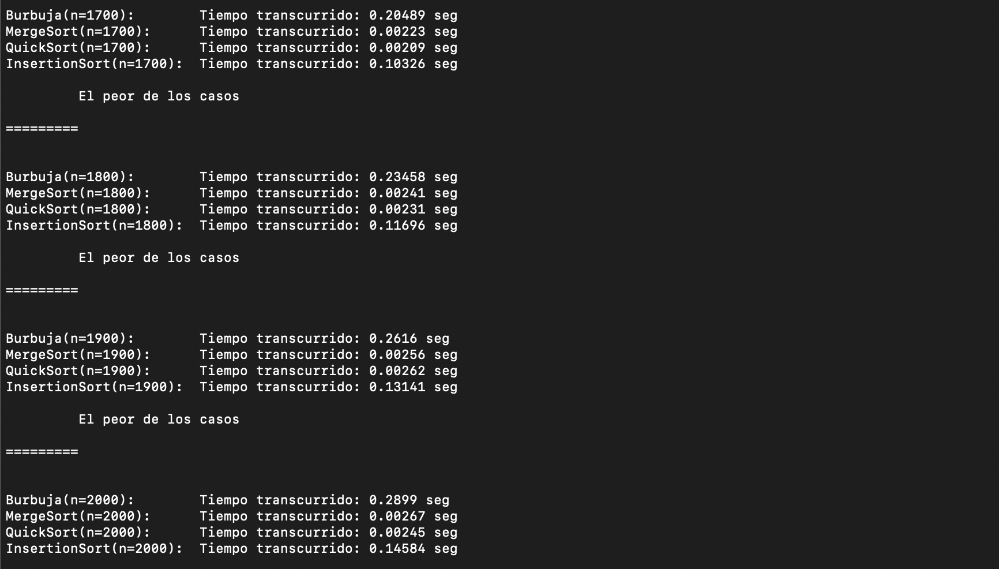
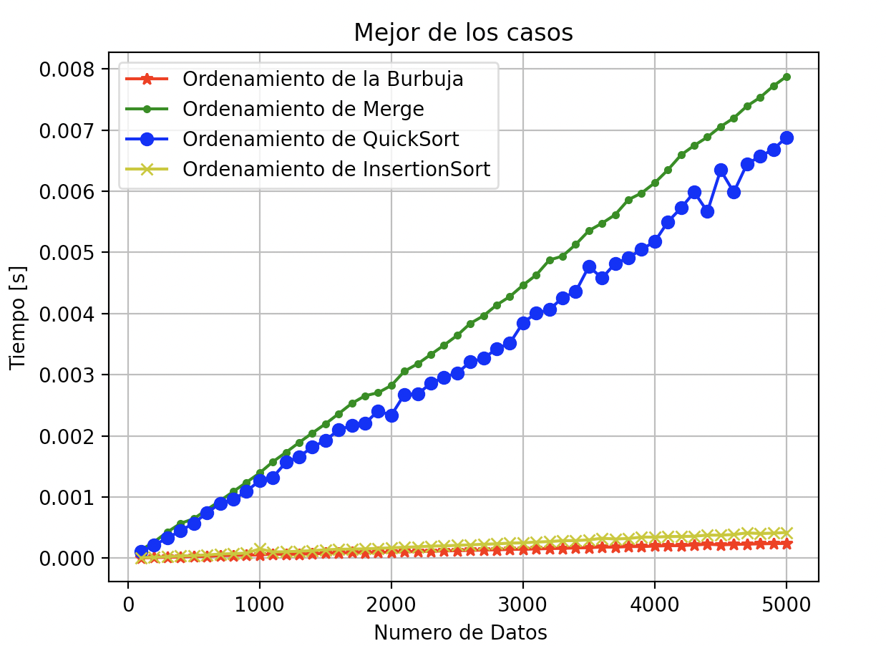
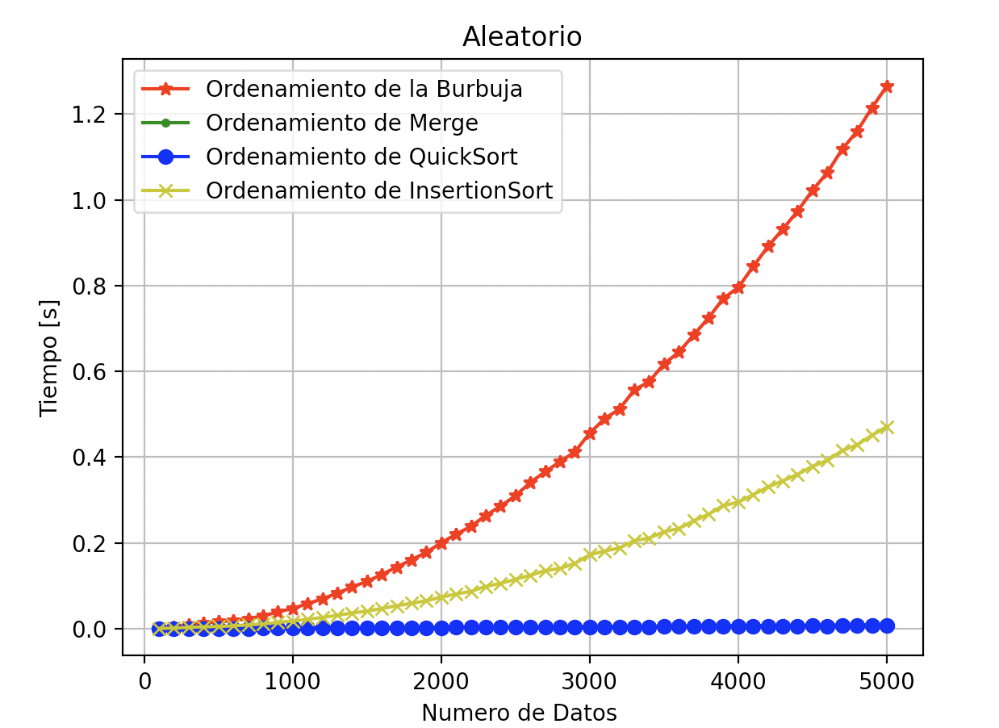
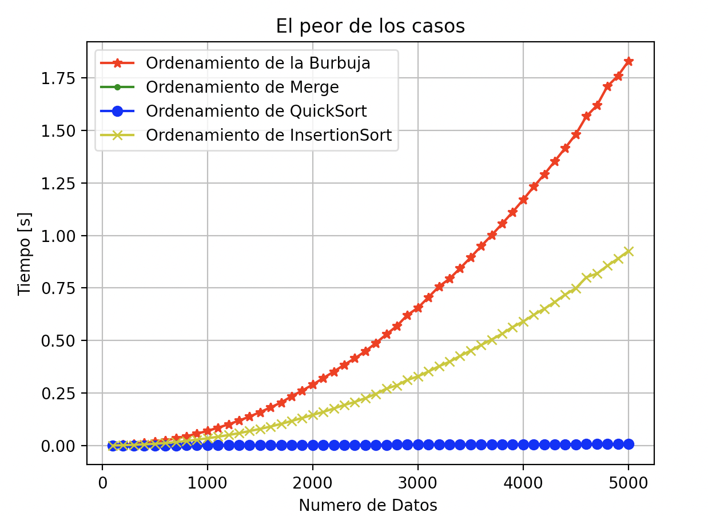

# Sorting-Algorithms-Efficiency
## Description
In this project, I compare 4 of the Sorting algorithms with a large amount of data. I learned all of them in 2nd Semester of College.  Those are next ones:
<ul>
    <li>BubbleSort</li>
    <li>QuickSort</li>
    <li>MergeSort</li>
    <li>InsertionSort</li>
</ul>

You can clone this repository and run this program with python 3+ 
 
You will get in the console something like this:  

### Best case:

### Average case:

### Worst case: 

## Quicksort ⏰
###### Best case, Average case:   O(nlogn)
###### Worst case:                O(n^2)
This algorithm mainly does the strategy called 'Divide & Conquer', choosing a pivot, 
and grouping in two sides, the left ones that are the ones smaller than the pivot, and
the right ones, which are greater than the pivot. In this exercise I decided to make it recursively.
 This sorting algorithm works better with a large data sets.
 Randomized Quicksort is mostly used to avoid the worst case, choosing a random pivot.

